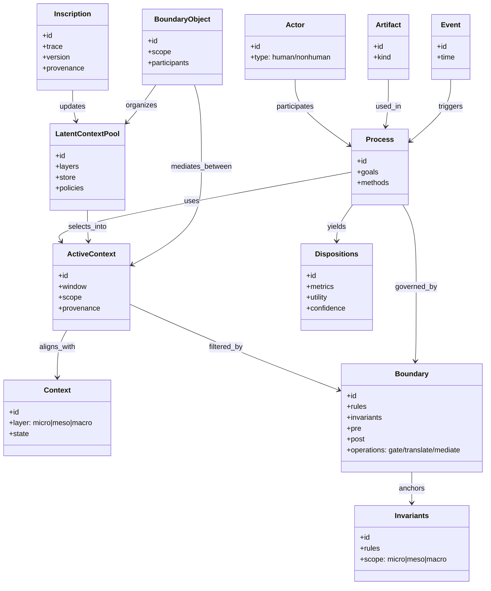

# PCE 概念モデル（Conceptual Model）

> 本書は **Process‑Context Engine (PCE)** の哲学的定義（pce.ja.md）を、**概念モデル**として静的・準形式的に定式化する。実装仕様（API/DB/アルゴリズム）は別ファイルで扱う。

---

## 0. 目的と適用範囲

- **目的**: PCEの中核構成要素・関係・制約・生成原理を、誰が読んでも同じ像を再構成できる程度に**明示化**する。
- **用途**: 研究・設計・レビュー時の共通参照。設計判断の**境界（Boundary）**や**不変量**を合意する基盤。
- **非目標**: 具体的実装・性能論・ストレージ選定・モデル選定。

---

## 1. 中核語彙（概念エンティティ）

### 1.1 基本要素

- **プロセス（Process; P）**: 解釈・判断・区別・記述などの能動的作動。単独ではなく相互作用の網の目の中で立ち現れる。
- **文脈（Context; C）**: 解釈・行為を制約／促進する多層の状態（micro/meso/macro）。背景ではなく**生成の場**。
- **境界（Boundary; B）**: 異なる文脈や記号体系を分節し接続する**閾**。翻訳・調停・ガードが生じる場。不変量の可視化点。
- **潜在的コンテキストプール（Latent Context Pool; LCP）**：文脈断片・規則・由来を関係として貯蔵するリザーバ。自性をもたず（§2.5／pce.ja.md §2.5）、境界・翻訳・記述化を通じて必要時に顕在化する。
- **アクティブコンテキスト（Active Context; AC）**：ある時点・課題に有効な **LCP の射影／切り出し**。ウィンドウ・範囲・由来を持つ短期的な作動集合。
- **解釈項（Dispositions; D）**：観測可能な変化の束（interpretant）。選好の更新、推論の閾値変化、他記号への再記述方針など。
  （注）本文では「Meaning」は写像 `meaning(s)` を指し、D はその出力（解釈項）に限定する。
- **行為者／成果物／事象（Actor / Artifact / Event）**: ANT 的語彙。人・組織・装置・文書・規範・出来事を含む行為者／成果物／事象。
- **記述化（Inscription）**: 痕跡・記録・規格・モデル等への沈着。安定化だが**可撤的**。
- **境界対象（Boundary Object）**: 異なる文脈層間の協働を媒介する共有物（Star & Griesemer）。

### 1.2 派生概念

- **Translation（翻訳）**: 異体系間で意味を移送・再配線する操作。
- **Mediation（媒介）**: 人・物・制度・装置が関与し、関係を変形させる作用点。
- **Invariants（不変量）**: 関係が変動しても保持される区別・制約・役割。
- **Pathology（病理）**: 生成の裏面に現れるドグマ化・漂流・ハイジャック等。

---

## 2. 準形式化（型・関数・制約）

### 2.1 型と集合

- 記号: \( s \in S \)
- 文脈: \( C \in \mathcal{C} \)（多層状態）
- 過程: \( P \in \mathcal{P} \)
- 境界: \( B \in \mathcal{B} \)
- 変化束: \( D \in \mathcal{D} \)

- 潜在文脈: \( C^L \in \mathcal{C}\_L \)（LCP の状態）
- アクティブ文脈: \( C^A \in \mathcal{C}\_A \)（LCP からの選択／要約）

- **S**：語彙上の部分順序 ≤ₛ（抽象度）と距離 dₛ（語彙距離）
- **𝒞**：層別部分順序 ≤꜀（micro/meso/macro の包含）と距離 d꜀（文脈差）
- **𝒫**：実行履歴に対する σ-代数 𝒜ₚ（観測事象）
- **ℬ**：不変量集合 I(B) と操作集合 Ops(B)
- **𝒟**：観測可能量の半順序 ≤𝒟（有用度・信頼度）と距離 d𝒟

### 2.2 意味関数（関数的定義）

```
meaning(s) := f(s, C, P) → D
```

- **functional ≠ functionalist**：ここでの「関数的」は**写像**を指し、役割・目的論（機能主義）とは区別する。
- _D_ の例: 選好の更新、推論の閾値変化、他記号への再記述方針。

※ 運用上，`f` は既定で **アクティブ文脈 \(C^A\)** に対して評価される（明示しない限り `C = C^A`）。

**（境界整合）** 任意の境界 B に対して不変量 I(B) をもつとき，
`pre_B(s, C, P) ∧ I(B) ⇒ D = f(s, C, P) ⊧ post_B(D) ∧ I(B)`
すなわち，境界の前提を満たす入力に対して，出力 D は境界の事後条件を満たしつつ不変量を保持する。

### 2.3 文脈更新

```
C_{t+1} = g(C_t, outputs(P_t), inscription_t, B_t, critic_t)
```

次の項 `critic_t` は成功条件束（§2.4）に基づく評価関数であり，revocability / traceability / replicability 等の指標を含む。

**〔アクティベーション（選択）〕**
C^A*t = r\!\left(q_t,\; C^L_t,\; B_t,\; policy_t,\; critic*{t-1}\right)
（`r` はクエリ `q_t` と境界・方針に基づき LCP から AC を選択／要約する関数）

**〔潜在更新（蒸留・統合）〕**
C^L\_{t+1} = h\!\left(C^L_t,\; inscription_t,\; feedback_t,\; B_t\right)
（`h` は記述化・フィードバックを LCP に統合し，冗長・矛盾を整理する関数）

### 2.4 成功条件束（可否判定の枠）

- **整合性** / **可搬性** / **反事実的堅牢性** / **行為的成功**
- **可撤性（revocability）** / **追跡可能性（traceability）** / **再現性（replicability）**

**観測指標の例**：

- 整合性：内部矛盾率，自己一致率
- 可搬性：異層間再利用成功率（Boundary Object 経由）
- 反事実的堅牢性：反証事例投入後の D 安定度
- 行為的成功：合意到達ステップ数，エラー減少率
- 可撤性：ロールバック時間，巻戻し成功率
- 追跡可能性：由来再構成の完了率，リンク切れ率
- 再現性：独立読者による D の近接度（d𝒟 の閾）

### 2.5 公理・不変条件

- **A1 非実体化**: 実体は運用上の近似。理論的説明は関数的・関係的に与える。
- **A2 共同生成**: 文脈と過程は相互に生成し合う（co‑production）。
- **A3 境界必須**: 実務的決着は境界を介して達成される（ガード・翻訳・調停）。
- **A4 可視化**: 痕跡・翻訳経路・境界の判断根拠は観測可能である。
- **A5 観測可能性**：主要判断（f, g, Boundary 操作）の根拠は痕跡として観測可能である。
- **A6 境界整合**：境界の前後条件は不変量 I(B) と両立し，操作合成に対して閉じている。

### 2.6 時間定数と層間結合（Pace-Aware 形式）

- 各文脈層 \(L \in \{\text{micro, meso, macro}\}\) に時間定数 \(\tau_L\) を与える（micro: 小 / meso: 中 / macro: 大）。
- 層別文脈の更新を
  \( C^{(L)}\_{t+1} = g^{(L)}\!\left(C^{(L)}\_t,\; \text{outputs}(P_t),\; \text{inscription}\_t,\; B_t,\; critic_t\right) \)
  とし，\(\tau_L\) に応じて更新幅を制約する。
- 層間結合は結合係数 \(k*{L \to M}\) で記す（下位→上位の昇格は \(k*{micro\to meso}, k*{meso\to macro}\) が小，上位→下位の拘束は \(k*{macro\to meso}, k\_{meso\to micro}\) が大）。
- **不変量の錨付け**：不変量 \(I(B)\) のうち制度・規範に属するものは macro 層に錨付けし，下位層の g は \(I(B)\) を侵害しない範囲でのみ更新を許す。

---

## 3. レイヤと境界（micro/meso/macro）

### 3.1 文脈の多層構造

- **micro**: 身体・注意・情動・直近相互行為。
- **meso**: 手続・実践・小集団規範・場の記録。
- **macro**: 制度・規範・文化・法・インフラ。

> 層間協働には **Boundary Objects** が媒介として機能する。

### 3.2 境界の型（例）

- **認知境界**: 注意・用語・目的・非目的の閾。
- **制度境界**: 役割・権限・評価・適用範囲。
- **技術境界**: I/F・型・制約・安全ガード。

### 3.3 境界の作用

- **Gating**（許可・拒否・編集／redact）
- **Translation**（語彙転写・図式変換・単位換算）
- **Mediation**（調停・合意・例外付与）

**前後条件（Hoare 風）**：

- Gating：`{ s ∈ S ∧ I(B) } gate(B) { s' ∈ S' ∧ I(B) }`
- Translation：`{ (s, C) ∧ I(B) } translate(B) { (s*, C*) ∧ I(B) }`
- Mediation：`{ conflict(C) } mediate(B) { consensus(C') ∧ evidence(inscription) }`

### 3.4 ペースレイヤリング（時間層と更新リズム）

| 層    | 例                         | 更新テンポ     | 役割                   |
| ----- | -------------------------- | -------------- | ---------------------- |
| micro | 注意・感情・会話の即時合意 | 速（秒～日）   | 実験・発見・変異       |
| meso  | 手続・チーム実践・設計規約 | 中（週～月）   | 蒸留・標準化・普及     |
| macro | 制度・規範・インフラ・文化 | 遅（年～十年） | 保全・安全・責任の保持 |

- **原則**：「遅い層は覚え，速い層は学ぶ」。遅層の不変量がガードとなり，速層の成果は Boundary Object と inscription を介して**昇格（distill）**される。
- **昇格/沈降の手続**：
  1. micro の成果を meso の **Boundary Object** に束ね，再現性を確認
  2. inscription とレビューを経て meso 規約へ編入
  3. 長期安全性・責任要件を満たすものだけが macro の不変量へ昇格
  4. 反証や事故時は **沈降（rollback）** し，下位層で再実験
- **LCP↔AC の対応**：LCP は主に meso/macro に錨付けられ，AC は micro に属する短期集合として作動する。
- **往還**：AC の成果は蒸留されて LCP に昇格し（distill），不整合・事故時は LCP の安全側へ沈降（rollback）する。

### 3.5 潜在プールとアクティブ文脈（役割と往還）

- **役割分担**：LCP は由来・規則・関係の**保存／整序**を担い，AC は課題遂行に必要な**一時的構成**を担う。
- **選択原理**：AC は `r(q, C^L, B, policy)` により，目的適合・由来・境界不変量を満たす断片から構成される。
- **評価と昇格**：AC が生んだ成果は §2.4 の成功条件束で評価され，合格したもののみが `h` を通じ LCP に**昇格**する。
- **エラー処理**：バイアスや誤適用が検出された場合は，AC の構成規則を修正し LCP では**沈降／抹消**で安全側に戻す。

---

## 4. 生成と安定化（ダイナミクス）

### 4.1 生成の主ループ

1. 観測 → 2) アクティベーション `C^A = r(q, C^L, B, policy, critic)` → 3) 解釈（`f(s,C^A,P) → D`）
   → 4) 行為 → 5) 記述化（inscription） → 6) 評価（critic; §2.4）
   → 7) 層別更新 `g^{(L)}`（`τ_L` と `I(B)` を尊重）／潜在更新 `h` → 8) 境界再調整（必要なら昇格/沈降）

```mermaid
flowchart LR
  Obs[観測/入力 s] --> Actv[アクティベーション r(q, C^L, B, policy, critic)]
  Actv --> Int[解釈 f(s, C^A, P) → D]
  Int --> Act[行為/決定]
  Act --> Ins[記述化 / 痕跡]
  Ins --> Crit[評価 / critic (§2.4)]
  Crit --> Upd[層別更新 g^{(L)} (τ_L, I(B)) / 潜在更新 h]
  Upd -->|条件により| Bnd[境界再調整]
  Bnd --> Actv
```

### 4.2 安定化（記述化）

- 痕跡・規格・モデルへの沈着により再現可能性を高める。
- **可撤性**: 誤り・文脈変化に応じて再記述できる。
- **版管理と由来**：バージョン管理とプロヴァナンスの保持により，追跡可能性と可撤性を担保する。

### 4.3 病理（発火条件）

- **翻訳の独占**: 特定アクターが経路を占有し反証が遮断される。
- **痕跡の不可視化**: 由来・修正履歴が追跡不能。
- **制約の過少／過多**: 不変量が緩すぎて漂流／硬すぎてドグマ化。
- **短絡（fast-overrides-slow）**：micro の一時解が macro の不変量を迂回して恒久化。
- **凍結（slow-overrides-fast）**：macro の硬直で実験が閉塞。

**緩和策**：

- 翻訳経路の複線化と代替境界の設置
- 痕跡の公開と由来リンクの強制（監査可能化）
- 不変量 I(B) の再設計（閾の上下限）と例外手続の導入
- ペース制御：昇格式の必須化・レビュー遅延の設定／限定サンドボックス境界の付与

---

## 6. 参照モデル（クラス/関係 図式）



---

## 7. 最小ケース（読解の手順）

**思考実験：仕様文の反転**  
同一のAPI仕様文を、(i) 開発会議、(ii) 法務レビュー、(iii) エンドユーザ告知の3文脈で読ませる。`meaning(s)` を各文脈 \(C_i\) に対して評価し、選好・閾値・再記述方針 \(D_i\) の差異を観測する。次に、Boundary（不変量）を1つだけ増減し、\(D_i\) がどう変化するかを追跡する。

観測指標例：用語の再記述率，誤読率，合意到達ステップ数，反証投入後の D 変動（d𝒟），ロールバック時間。

---

## 8. 用語集（簡略）

- **関数的**: 写像としての関係。**機能的**（目的・役割）とは区別。
- **不変量**: 変換下で保たれる性質。PCEでは境界の核を構成。
- **記述化**: 痕跡・規格・モデルへの沈着。可撤・追跡可能。
- **境界対象**: 異文脈間の協働を媒介する共有物。
