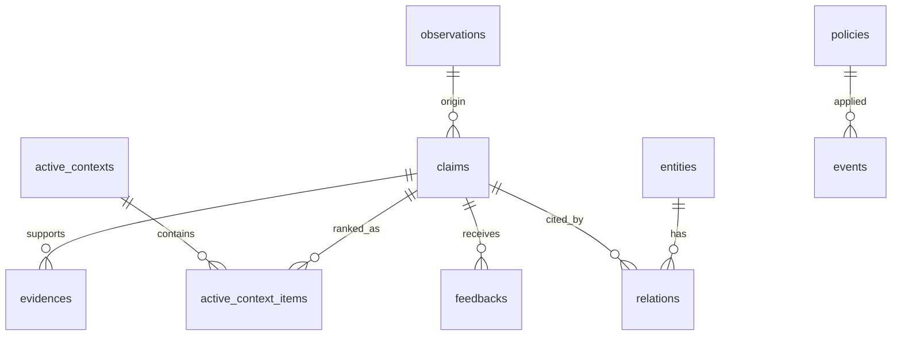

## 0. 方針と前提

- 時刻：**TIMESTAMP（UTC）** を格納（アプリ側は必要に応じて epoch 秒に変換）

## 1. 初期セットアップ（任意拡張のロード例）

```sql
-- 任意の拡張ロード例
INSTALL fts; LOAD fts;
```

### 1.1 SQL マクロ（ベクトル類似）

```sql
-- LIST[Double] 同士のコサイン類似（要：同次元）
CREATE MACRO IF NOT EXISTS cos_sim(a, b) AS (
  list_sum(list_transform(list_zip(a, b), x -> x[1]*x[2]))
  / NULLIF(sqrt(list_sum(list_transform(a, x -> x*x))), 0)
  / NULLIF(sqrt(list_sum(list_transform(b, x -> x*x))), 0)
);
```

### 4.1 Observations（生観測）

```sql
CREATE TABLE observations (
  id          BIGINT PRIMARY KEY,
  created_at    TIMESTAMP NOT NULL   -- UTC
  -- その他のカラム
);
```

### 4.2 Claims（抽出主張・検索対象）

```sql
CREATE TABLE claims (
  id                    BIGINT PRIMARY KEY,
  created_at             TIMESTAMP NOT NULL,
  updated_at             TIMESTAMP NOT NULL
  -- その他のカラム
);
```

### 5.3 Feedbacks（Critic 入力）

```sql
CREATE TABLE feedbacks (
  id        BIGINT PRIMARY KEY,
  ts        TIMESTAMP NOT NULL,
  -- その他のカラム
);
```

### 6.1 Active Context（短期・使い捨て）

```sql
CREATE TABLE active_context (
  id             BIGINT PRIMARY KEY,
  expires_at     TIMESTAMP NOT NULL,
  -- その他のカラム
);
```

### 6.3 Policies（適用 YAML・版）

```sql
CREATE TABLE policies (
  id          BIGINT PRIMARY KEY,
  loaded_at   TIMESTAMP NOT NULL,
  -- その他のカラム
);
```

### 6.4 Events / Telemetry（監査・運用）

```sql
CREATE TABLE events (
  id         BIGINT PRIMARY KEY,
  ts         TIMESTAMP NOT NULL,
  -- その他のカラム
);
```

### 6.5 時刻ビュー（epoch 互換）

```sql
CREATE OR REPLACE VIEW events_epoch AS
SELECT id, epoch(ts) AS ts_epoch, topic, payload, request_id, trace_id FROM events;
CREATE OR REPLACE VIEW claims_epoch AS
SELECT id, text, kind, scope, boundary_class, epoch(created_at) AS created_at_epoch, epoch(updated_at) AS updated_at_epoch
FROM claims;
```

### 7.2 ベクトル類似（拡張無し／全件計算の例）

```sql
-- :qvec は LIST<DOUBLE>（クエリ埋め込み）。cos_sim マクロを利用。
SELECT v.claim_id,
       cos_sim(v.embedding, :qvec) AS sim
FROM claim_vectors AS v
JOIN claims AS c ON c.id = v.claim_id
WHERE c.scope IN ('session','project','principle')
ORDER BY sim DESC
LIMIT :k;
```

---

## 12. 拡張：DuckDB FTS/VSS 導入（雛形）

> 必要になった段階で導入してください。拡張が無い環境でも本スキーマは動作します。

```sql
-- FTS（全文検索）
INSTALL fts;  LOAD fts;
-- 例：仮のテキストインデックス（実際のシンタックスは拡張ドキュメントに従う）
-- CREATE VIRTUAL TABLE claim_fts USING fts_main(...);

-- VSS（ベクトル近傍探索）
INSTALL vss;  LOAD vss;
-- 例：VSS インデックス作成（仮）
-- CREATE INDEX idx_vec ON claim_vectors USING vss(embedding) WITH (metric = 'cosine');
```

拡張の具体的な使い方やベンチマークは、別途 `search_extensions_duckdb.md` にまとめる予定です。

# pce-memory DB Schema（SQLite v0）

> 目的：**自己ホスト**・**監査可能**・**再現可能**な PCE-Memory を最小コストで運用するための **SQLite スキーマ v0**。
> ハイブリッド検索（**FTS5+ベクトル**）、**LCP/AC（二相）**、**Boundary/Policy**、**Critic/Telemetry** をカバーする。

---

## 0. 前提・方針

- ストア：SQLite（単一ファイル）
- 文字コード：UTF-8 / NFC 正規化（`content_hash` 生成前に実施）
- 時刻：UNIX epoch（**秒**）整数
- ベクトル：`sqlite-vec`（`vec0` 仮想テーブル）/ 既定次元は 384（E5-small 相当）
- 文章検索：FTS5（`content='claims'`）
- スキーマ版管理：`PRAGMA user_version = <int>`

運用の要件は以下に反映：

- **Boundary-First**：`boundary_class`、Policy 版、AC スナップショットに由来を残す
- **Provenance-by-Default**：Observation→Claim→Evidence の鎖
- **Pace-aware**：AC（短期）/ LCP（長期）を分離
- **Critic-in-the-Loop**：feedback により utility/confidence/recency を更新

---

## 1. 推奨 PRAGMA

```sql
PRAGMA journal_mode=WAL;             -- 同時実行と耐障害性
PRAGMA synchronous=NORMAL;           -- パフォーマンス/耐障害性の妥協点
PRAGMA foreign_keys=ON;              -- 外部キー有効
PRAGMA temp_store=MEMORY;
PRAGMA mmap_size=268435456;          -- 256MB（環境に合わせ調整）
PRAGMA user_version=1;               -- スキーマ版（マイグレーションで更新）
```

---

## 2. ER 概要



---

## 3. DDL（コア）

### 3.1 Observations（生観測）

```sql
CREATE TABLE IF NOT EXISTS observations (
  id                  TEXT PRIMARY KEY,
  source_type         TEXT NOT NULL,    -- chat|tool|file|http|system
  source_id           TEXT,
  content             TEXT NOT NULL,
  actor               TEXT,             -- who
  tags                TEXT,             -- comma-separated
  created_at          INTEGER NOT NULL  -- epoch seconds
);
CREATE INDEX IF NOT EXISTS idx_observations_source ON observations(source_type, created_at);
```

### 3.2 Claims（抽出主張・検索対象）

```sql
CREATE TABLE IF NOT EXISTS claims (
  id                     TEXT PRIMARY KEY,
  text                   TEXT NOT NULL,
  kind                   TEXT NOT NULL CHECK (kind IN ('fact','preference','task','policy_hint')),
  scope                  TEXT NOT NULL CHECK (scope IN ('session','project','principle')),
  boundary_class         TEXT NOT NULL CHECK (boundary_class IN ('public','internal','pii','secret')),
  origin_observation_id  TEXT REFERENCES observations(id) ON DELETE SET NULL,
  quality                REAL NOT NULL DEFAULT 0.5,
  confidence             REAL NOT NULL DEFAULT 0.5,
  utility                REAL NOT NULL DEFAULT 0.0,
  recency                REAL NOT NULL DEFAULT 0.0,
  content_hash           TEXT UNIQUE,
  created_at             INTEGER NOT NULL,
  updated_at             INTEGER NOT NULL
);
CREATE INDEX IF NOT EXISTS idx_claims_scope_boundary ON claims(scope, boundary_class);
CREATE INDEX IF NOT EXISTS idx_claims_qcur ON claims(quality, confidence, utility, recency);
```

### 3.3 FTS5（全文検索）

```sql
CREATE VIRTUAL TABLE IF NOT EXISTS claim_fts USING fts5(
  text, content='claims', content_rowid='rowid'
);
-- 同期トリガ（INSERT/UPDATE/DELETE）
CREATE TRIGGER IF NOT EXISTS claims_ai AFTER INSERT ON claims BEGIN
  INSERT INTO claim_fts(rowid, text) VALUES (new.rowid, new.text);
END;
CREATE TRIGGER IF NOT EXISTS claims_au AFTER UPDATE OF text ON claims BEGIN
  UPDATE claim_fts SET text = new.text WHERE rowid = new.rowid;
END;
CREATE TRIGGER IF NOT EXISTS claims_ad AFTER DELETE ON claims BEGIN
  DELETE FROM claim_fts WHERE rowid = old.rowid;
END;
```

### 3.4 ベクトル（sqlite-vec / vec0）

> 例：次元 384。導入手順は `sqlite-vec` のドキュメントに従う。

```sql
CREATE VIRTUAL TABLE IF NOT EXISTS claim_vectors USING vec0(
  claim_id TEXT PRIMARY KEY,    -- claims.id
  embedding FLOAT[384]
);
```

---

## 4. DDL（グラフ・由来・フィードバック）

### 4.1 Entities / Relations（薄いグラフ）

```sql
CREATE TABLE IF NOT EXISTS entities (
  id             TEXT PRIMARY KEY,
  type           TEXT NOT NULL CHECK (type IN ('Actor','Artifact','Event','Concept','Policy')),
  name           TEXT NOT NULL,
  canonical_key  TEXT,
  attrs          JSON
);
CREATE UNIQUE INDEX IF NOT EXISTS idx_entities_canonical ON entities(type, canonical_key);

CREATE TABLE IF NOT EXISTS relations (
  id                  TEXT PRIMARY KEY,
  src_id              TEXT NOT NULL REFERENCES entities(id) ON DELETE CASCADE,
  dst_id              TEXT NOT NULL REFERENCES entities(id) ON DELETE CASCADE,
  type                TEXT NOT NULL, -- created|mentions|assigned_to|depends_on|...
  props               JSON,
  evidence_claim_id   TEXT REFERENCES claims(id) ON DELETE SET NULL
);
CREATE INDEX IF NOT EXISTS idx_rel_src ON relations(src_id);
CREATE INDEX IF NOT EXISTS idx_rel_dst ON relations(dst_id);
```

### 4.2 Evidences（由来鎖）

```sql
CREATE TABLE IF NOT EXISTS evidences (
  id             TEXT PRIMARY KEY,
  claim_id       TEXT NOT NULL REFERENCES claims(id) ON DELETE CASCADE,
  observation_id TEXT REFERENCES observations(id) ON DELETE SET NULL,
  method         TEXT NOT NULL,   -- rule|llm|manual
  note           TEXT
);
CREATE INDEX IF NOT EXISTS idx_evidences_claim ON evidences(claim_id);
```

### 4.3 Feedbacks（Critic 入力）

```sql
CREATE TABLE IF NOT EXISTS feedbacks (
  id        TEXT PRIMARY KEY,
  claim_id  TEXT NOT NULL REFERENCES claims(id) ON DELETE CASCADE,
  ts        INTEGER NOT NULL,
  signal    TEXT NOT NULL CHECK (signal IN ('helpful','harmful','outdated','duplicate')),
  score     REAL DEFAULT 0.0
);
CREATE INDEX IF NOT EXISTS idx_feedbacks_claim_ts ON feedbacks(claim_id, ts);
```

---

## 5. DDL（AC/LCP・Policy・Telemetry）

### 5.1 Active Context（短期・使い捨て）

```sql
CREATE TABLE IF NOT EXISTS active_contexts (
  id             TEXT PRIMARY KEY,
  window         TEXT,            -- 文字列の範囲表現
  scope          TEXT NOT NULL CHECK (scope IN ('session','project','principle')),
  provenance     JSON,
  expires_at     INTEGER NOT NULL,
  policy_version TEXT NOT NULL
);
CREATE INDEX IF NOT EXISTS idx_ac_expires ON active_contexts(expires_at);

CREATE TABLE IF NOT EXISTS active_context_items (
  ac_id    TEXT NOT NULL REFERENCES active_contexts(id) ON DELETE CASCADE,
  claim_id TEXT NOT NULL REFERENCES claims(id) ON DELETE CASCADE,
  rank     INTEGER NOT NULL,
  score    REAL,
  PRIMARY KEY (ac_id, claim_id)
);
CREATE INDEX IF NOT EXISTS idx_ac_items_rank ON active_context_items(ac_id, rank);
```

### 5.2 Latent Context Pool（長期・統合）

> LCP 自体は「メタ情報」のみ。実体は `claims/entities/relations/evidences`。

```sql
CREATE TABLE IF NOT EXISTS latent_pool (
  id       TEXT PRIMARY KEY,
  layers   JSON,      -- micro/meso/macro の方針（任意）
  store    JSON,      -- 物理配置のメタ
  policies JSON       -- 適用中ポリシーのメタ
);
```

### 5.3 Policies（適用 YAML・版）

```sql
CREATE TABLE IF NOT EXISTS policies (
  id          TEXT PRIMARY KEY,
  version     TEXT NOT NULL,     -- SemVer
  raw_yaml    TEXT NOT NULL,
  loaded_at   INTEGER NOT NULL
);
CREATE INDEX IF NOT EXISTS idx_policies_version ON policies(version);
```

### 5.4 Events / Telemetry（監査・運用）

```sql
CREATE TABLE IF NOT EXISTS events (
  id        TEXT PRIMARY KEY,
  ts        INTEGER NOT NULL,
  topic     TEXT NOT NULL,     -- ingest|integrate|search|filter|answer|critic|policy
  payload   JSON,
  request_id TEXT,
  trace_id   TEXT
);
CREATE INDEX IF NOT EXISTS idx_events_topic_ts ON events(topic, ts);
```

---

## 6. 代表クエリ（ハイブリッド検索／AC 構成）

### 6.1 FTS × ベクトル（ハイブリッド）

```sql
-- 例: クエリ埋め込みはアプリ側で生成し、:qvec にバインド
WITH
bm AS (
  SELECT rowid AS claim_rowid, bm25(claim_fts) AS bm, highlight(claim_fts,0,'<b>','</b>') AS snippet
  FROM claim_fts WHERE claim_fts MATCH :q_fts
  ORDER BY bm LIMIT 200
),
ve AS (
  SELECT claim_id, distance FROM claim_vectors
  WHERE knn_make(:qvec, embedding, 12)
),
scored AS (
  SELECT c.id,
         -- 正規化スコア（例）
         (1.0/(1.0+ve.distance)) * 0.65 + (1.0/(1.0+bm.bm)) * 0.35 AS score
  FROM claims c LEFT JOIN bm ON bm.claim_rowid=c.rowid
                LEFT JOIN ve ON ve.claim_id=c.id
  WHERE c.scope IN ('session','project','principle')
)
SELECT * FROM scored ORDER BY score DESC LIMIT :k;
```

### 6.2 AC への取り込み

```sql
-- 事前: INSERT INTO active_contexts(...);
INSERT INTO active_context_items(ac_id, claim_id, rank, score)
SELECT :ac_id, id, ROW_NUMBER() OVER (ORDER BY score DESC), score
FROM (
  -- 6.1 の scored サブクエリをインライン展開
) LIMIT :k;
```

---

## 7. マイグレーション指針

- 版管理：`PRAGMA user_version` を **整数インクリメント**（v0.1 = 1, v0.2 = 2 ...）
- 例：**v1→v2**（列追加の non-breaking）

```sql
BEGIN;
PRAGMA user_version;              -- 1 を期待
ALTER TABLE claims ADD COLUMN source_hint TEXT;
PRAGMA user_version=2;
COMMIT;
```

- 例：**破壊的変更**は `CREATE TABLE new_*` → データ移送 → `DROP/RENAME` の手順で安全に
- すべての変更は `events(topic='schema')` にも記録すること（監査）

---

## 8. インデックス戦略（要点）

- 高頻度フィルタ：`claims(scope, boundary_class)`、`feedbacks(claim_id, ts)`、`events(topic, ts)`
- 参照整合：`relations(src_id)`／`relations(dst_id)`、`evidences(claim_id)`
- FTS/ベクトルは**別系**としてチューニング（`LIMIT` をうまく使い、最終段で結合）

---

## 9. セキュリティ・整合の注意

- **foreign_keys=ON** を常時有効
- `content_hash` は **正規化後**に計算（NFC・改行LF・空白圧縮）
- `boundary_class='secret'` の upsert はアプリ層で拒否（DB は last line of defense）
- 監査：`events` に `request_id/trace_id/policy_version` を残す

---

## 10. 将来拡張（v0→v1 の候補）

- Postgres/pgvector 互換の DDL 併記
- `claim_vectors` の ANN パラメタ（HNSW 等）
- `policy_applied` の履歴テーブル（適用範囲/承認者）
- 変更データキャプチャ（CDC）用のトリガ／queue
